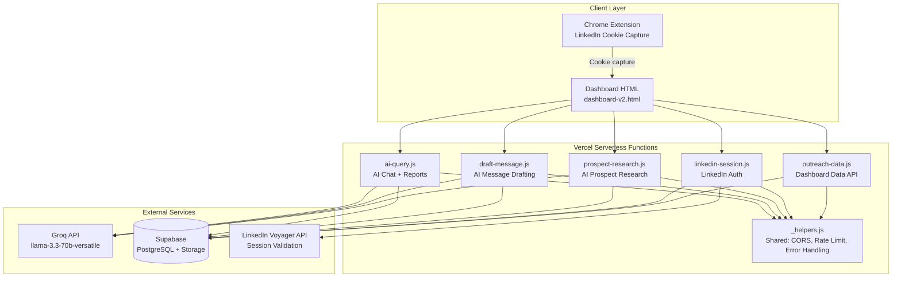

# ARCHITECTURE — Annas AI Hub

## System Overview



## Data Flow


## Tech Stack

| Layer | Technology | Rationale |
|-------|-----------|-----------|
| **Frontend** | Vanilla HTML/CSS/JS (single file) | Zero build step, instant deploy via Vercel, no framework overhead |
| **Backend** | Vercel Serverless Functions (Node.js) | Zero-config deployment, auto-scaling, free tier sufficient |
| **AI/LLM** | Groq (llama-3.3-70b-versatile) | Fastest inference, free tier, OpenAI-compatible API |
| **Database** | Supabase (PostgreSQL) | Free tier, REST API, built-in auth, Storage for metrics JSON |
| **Encryption** | AES-256-GCM (Node.js crypto) | Industry standard, native Node.js, no external dependency |
| **Auth** | LinkedIn Voyager API (session cookies) | Direct LinkedIn integration without OAuth app approval |

## Integration Points

| Integration | Endpoint | Auth Method | Data Direction |
|-------------|----------|-------------|----------------|
| Groq API | `api.groq.com/openai/v1/chat/completions` | Bearer token (GROQ_API_KEY) | Outbound (prompts) → Inbound (completions) |
| Supabase REST | `{SUPABASE_URL}/rest/v1/{table}` | Service role key (SUPABASE_SERVICE_ROLE_KEY) | Bidirectional |
| Supabase Storage | `{SUPABASE_URL}/storage/v1/object/public/dashboard-data` | Public (read-only) | Inbound only |
| LinkedIn Voyager | `linkedin.com/voyager/api/me` | Session cookies (li_at + JSESSIONID) | Inbound (profile validation) |

## Error Handling Strategy

**Three-tier model** (per rules.md):

1. **Service layer** (`_helpers.js`): Shared CORS, rate limiting, Supabase URL validation
2. **Route handler**: Input validation, business logic errors, external API errors
3. **Global boundary**: `try/catch` wrapping entire handler, `errorResponse()` returns `{ error: "public message" }` — never exposes internals

**Standard error shape**: `{ error: string }` — all endpoints return this on failure.

## Security Architecture

- **CORS**: Origin whitelist (annas-ai-hub.vercel.app + preview deploys + localhost)
- **Rate limiting**: Per-IP sliding window (in-memory, resets on cold start)
- **Encryption**: AES-256-GCM for LinkedIn credentials (LINKEDIN_ENCRYPTION_KEY env var)
- **Input sanitisation**: `sanitizeForPrompt()` strips control chars, caps length; `escHtml()` prevents XSS on frontend
- **No client-side secrets**: All API keys are server-side only (Vercel env vars)

## Directory Structure

```
annas-ai-hub/
├── .ai/
│   └── rules.md                    # Engineering rules
├── api/                            # Vercel serverless functions
│   ├── _helpers.js                 # Shared: CORS, rate limit, Supabase, errors
│   ├── ai-query.js                 # AI chat + report generation
│   ├── draft-message.js            # AI message drafting
│   ├── linkedin-session.js         # LinkedIn auth (encrypt/store/validate)
│   ├── outreach-data.js            # Dashboard data from Supabase
│   └── prospect-research.js        # AI prospect research
├── chrome-extension/               # LinkedIn cookie capture extension
│   ├── manifest.json
│   ├── background.js
│   └── content.js
├── dashboard/
│   └── frontend/
│       └── dashboard-v2.html       # Main dashboard (monolith — needs splitting)
├── docs/
│   ├── diagrams/                   # Mermaid source files
│   └── decisions/                  # Architecture Decision Records
├── PROJECT_STATUS.md
├── ARCHITECTURE.md
├── CHANGELOG.md
├── TECH_DEBT.md
└── vercel.json                     # Vercel deployment config
```
