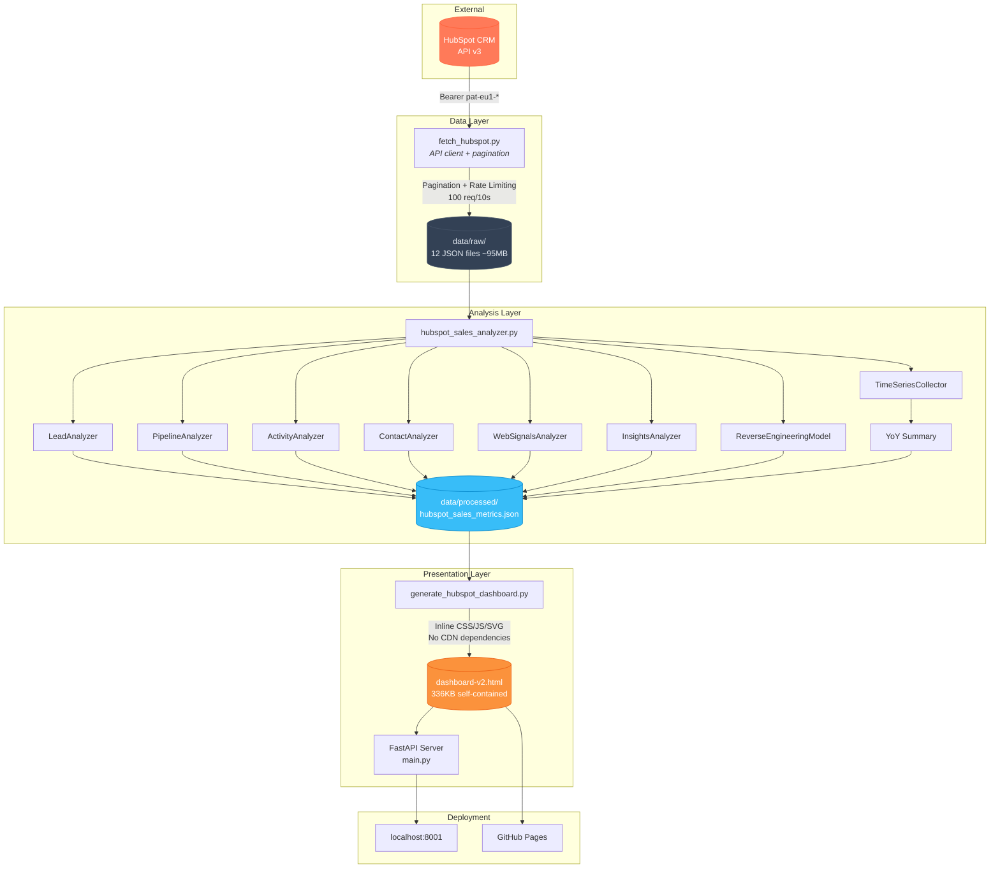
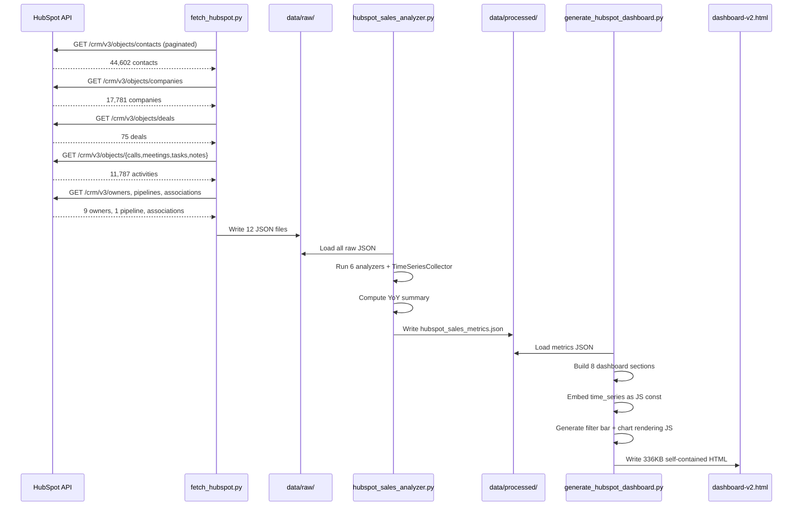
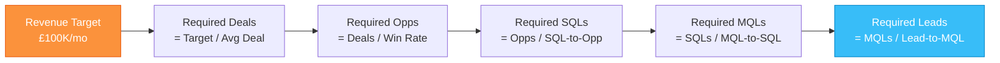
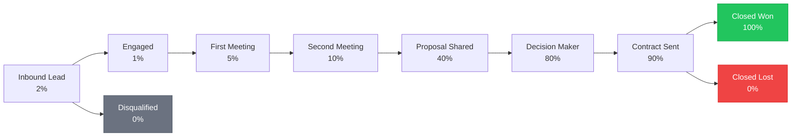

# HubSpot Sales Intelligence Dashboard

## Overview

A comprehensive, self-contained sales intelligence dashboard that pulls data from HubSpot CRM API v3, analyzes it across 6 dimensions, and generates an interactive HTML dashboard with time-period filtering and YoY comparisons.

Built for a 4-10 person sales team running a mixed inbound + outbound motion.

---

## Architecture



---

## Pipeline Flow



---

## Dashboard Sections

| # | Section | Key Metrics | Interactive |
|---|---------|-------------|-------------|
| 1 | Executive Summary | Pipeline value, win rate, open deals, activities, contacts, avg deal size | KPIs update on filter |
| 2 | Leads & Sources | Leads by source, MQL/SQL counts, lead status, source effectiveness | Filtered bar charts |
| 3 | Qualified Leads & Funnel | Conversion funnel: Lead > MQL > SQL > Opp > Customer | Static (long-term) |
| 4 | Target Setting | Revenue targets, reverse-engineering model, what-if scenarios | Static (configurable) |
| 5 | Pipeline View | Stage breakdown, velocity, stale deals, pipeline by owner | Static (snapshot) |
| 6 | Activity Tracking | Calls/emails/meetings/tasks by rep, daily trends | Filtered breakdown |
| 7 | Contacts & Companies | Lifecycle stages, top engaged contacts, company summary | KPI updates |
| 8 | Insights & Forecast | Win/loss analysis, sales cycle trends, revenue forecast, cohort analysis | Static (analytical) |

---

## Time Filtering

The dashboard includes an interactive filter bar with 6 time periods:

| Filter | Date Range | Description |
|--------|-----------|-------------|
| This Week | Mon-Sun of current week | Current week performance |
| Last Week | Previous Mon-Sun | Last week's results |
| MTD | 1st of month to today | Month-to-date |
| **YTD** (default) | Jan 1 to today | Year-to-date |
| Last Year | Jan 1 - Dec 31 of prev year | Full previous year |
| All Time | No filter | Everything |

**YoY Badges**: When YTD or All Time is selected, KPI cards show Year-over-Year comparison badges (e.g., "+12.2% YoY").

---

## HubSpot API Endpoints

| Data | Endpoint | Records |
|------|----------|---------|
| Contacts | `GET /crm/v3/objects/contacts` | 44,602 |
| Companies | `GET /crm/v3/objects/companies` | 17,781 |
| Deals | `GET /crm/v3/objects/deals` | 75 |
| Calls | `GET /crm/v3/objects/calls` | 86 |
| Meetings | `GET /crm/v3/objects/meetings` | 3,670 |
| Tasks | `GET /crm/v3/objects/tasks` | 7,113 |
| Notes | `GET /crm/v3/objects/notes` | 918 |
| Owners | `GET /crm/v3/owners/` | 9 |
| Pipelines | `GET /crm/v3/pipelines/deals` | 1 |
| Associations | `POST /crm/v4/associations/batch/read` | 3 types |

Authentication: Private App token (`pat-eu1-*`) via Bearer header.

---

## File Structure

```
Annas Ai Hub/
├── .env                              # API keys (gitignored)
├── .env.example                      # Template
├── .gitignore
├── requirements.txt
├── HUBSPOT_DASHBOARD.md              # This file
│
├── scripts/
│   ├── fetch_hubspot.py              # HubSpot API client (392 lines)
│   ├── hubspot_sales_analyzer.py     # 6 analyzers + time series (1560 lines)
│   └── generate_hubspot_dashboard.py # Dashboard HTML generator (2200+ lines)
│
├── data/
│   ├── raw/                          # Raw HubSpot JSON (gitignored, ~95MB)
│   │   ├── hubspot_contacts_YYYY-MM-DD.json
│   │   ├── hubspot_companies_YYYY-MM-DD.json
│   │   ├── hubspot_deals_YYYY-MM-DD.json
│   │   └── ... (12 files total)
│   └── processed/
│       └── hubspot_sales_metrics.json  # Analyzed metrics (~52KB)
│
├── dashboard/
│   ├── api/
│   │   └── main.py                   # FastAPI server
│   └── frontend/
│       ├── dashboard-v2.html         # Generated dashboard (~336KB)
│       └── index.html                # Original AlpineJS frontend
│
└── integrations/
    └── hubspot.py                    # Async HubSpot client
```

---

## Reverse Engineering Model

The target-setting module calculates required top-of-funnel volume:



Current rates from real data:
- Win rate: 27%
- Avg deal size: £15,717
- Avg sales cycle: 105 days

---

## Quick Start

```bash
# 1. Install dependencies
pip install -r requirements.txt

# 2. Set HubSpot API key in .env
# HUBSPOT_API_KEY=pat-eu1-your-token-here

# 3. Fetch data from HubSpot
python scripts/fetch_hubspot.py

# 4. Analyze data
python scripts/hubspot_sales_analyzer.py

# 5. Generate dashboard
python scripts/generate_hubspot_dashboard.py

# 6. Serve locally
uvicorn dashboard.api.main:app --port 8001
# Open http://localhost:8001
```

---

## Sales Team (Owners)

| Name | Email |
|------|-------|
| Rose Galbally | rose.galbally@ecomplete.com |
| James Carberry | james.carberry@ecomplete.com |
| Skye Whitton | skylar.whitton@ecomplete.com |
| Josh Elliott | josh.elliott@ecomplete.com |
| Anna Younger | anna.younger@ecomplete.com |
| Caldon Henson | caldon.henson@ecomplete.com |
| Paul Gedman | paul.gedman@ecomplete.com |
| Jake Heath | jake.heath@ecomplete.com |
| Kirill Kopica | kirill.kopica@ecomplete.com |

---

## Pipeline: All New Business



---

## Configuration

Edit `DEFAULT_CONFIG` in `hubspot_sales_analyzer.py`:

```python
DEFAULT_CONFIG = {
    "revenue_target": {
        "monthly": 100_000,
        "quarterly": 300_000,
        "annual": 1_200_000,
    },
    "stale_deal_threshold_days": 30,
    "activity_targets": {
        "calls_per_rep_per_day": 15,
        "emails_per_rep_per_day": 25,
        "meetings_per_rep_per_week": 5,
    },
}
```
