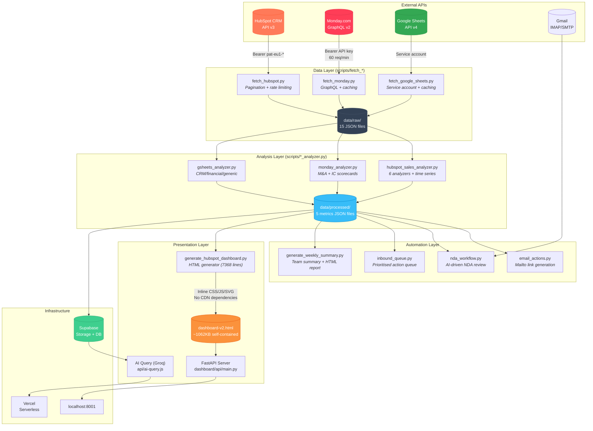
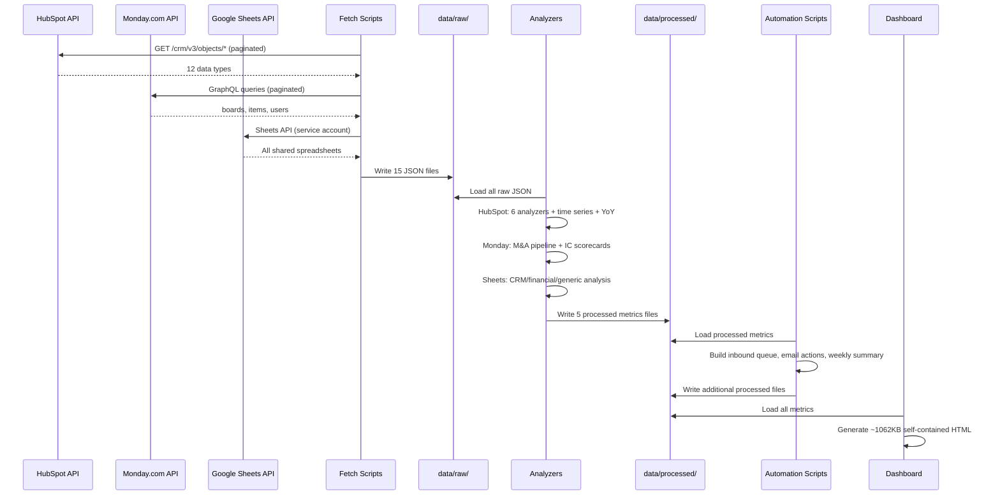
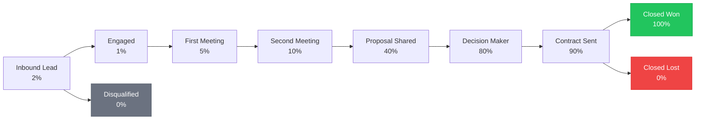
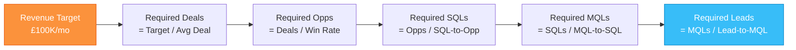

# Annas AI Hub

## Overview

A multi-integration sales and M&A intelligence platform that pulls data from HubSpot CRM, Monday.com, and Google Sheets, then analyzes, enriches, and presents it through interactive dashboards, automated workflows, and an AI query assistant.

Built for a 4-10 person sales team at eComplete running a mixed inbound + outbound motion with M&A deal tracking.

---

## Architecture



---

## Integrations

### HubSpot CRM

| Data | Endpoint | Records |
|------|----------|---------|
| Contacts | `GET /crm/v3/objects/contacts` | 44,602 |
| Companies | `GET /crm/v3/objects/companies` | 17,781 |
| Deals | `GET /crm/v3/objects/deals` | 75 |
| Calls | `GET /crm/v3/objects/calls` | 86 |
| Meetings | `GET /crm/v3/objects/meetings` | 3,670 |
| Tasks | `GET /crm/v3/objects/tasks` | 7,113 |
| Notes | `GET /crm/v3/objects/notes` | 918 |
| Owners | `GET /crm/v3/owners/` | 9 |
| Pipelines | `GET /crm/v3/pipelines/deals` | 1 |
| Associations | `POST /crm/v4/associations/batch/read` | 3 types |

Authentication: Private App token (`pat-eu1-*`) via Bearer header. Rate limit: 100 req/10s.

### Monday.com

Connects via GraphQL API v2 for M&A project tracking and IC (Investment Committee) scorecard progressions.

- **Boards**: All boards across workspaces (auto-discovered)
- **Items**: Full item data with column values, owners, and status
- **Users**: Team member mapping for owner resolution
- **Caching**: Per-board caching with configurable TTL (default 4 hours)
- **Rate limit**: 60 req/min

### Google Sheets

Connects via service account for spreadsheet data ingestion.

- **Auto-discovery**: Pulls all sheets shared with the service account
- **Sheet type detection**: CRM, financial, or generic (based on column analysis)
- **Caching**: Per-sheet caching with configurable TTL (default 1 hour)

---

## Pipeline Flow



---

## Scripts Reference

### Data Fetchers

| Script | Lines | Description |
|--------|-------|-------------|
| `fetch_hubspot.py` | 391 | HubSpot API client with pagination, rate limiting, and 12-file JSON export |
| `fetch_monday.py` | 450 | Monday.com GraphQL client with per-board caching and configurable TTL |
| `fetch_google_sheets.py` | 482 | Google Sheets API client with auto-discovery and per-sheet caching |

### Analyzers

| Script | Lines | Description |
|--------|-------|-------------|
| `hubspot_sales_analyzer.py` | 1571 | 6 analyzers (Lead, Pipeline, Activity, Contact, WebSignals, Insights) + reverse engineering model + time series + YoY |
| `monday_analyzer.py` | 944 | M&A project progression, IC scorecard tracking, workspace grouping, stale project detection |
| `gsheets_analyzer.py` | 557 | Extensible sheet-type detection (CRM/financial/generic) with pluggable analyzer subclasses |

### Automation & Workflows

| Script | Lines | Description |
|--------|-------|-------------|
| `email_actions.py` | 292 | Generates mailto links and pre-populated email content from templates in `config/email_templates.json` |
| `nda_workflow.py` | 1853 | AI-driven NDA review: PDF/DOCX parsing, clause checking against `config/nda_parameters.json`, Gmail inbox polling, templated responses |
| `inbound_queue.py` | 834 | Aggregates signals from all data sources into a prioritised action queue with AI-recommended next actions |
| `generate_weekly_summary.py` | 1702 | Generates per-person activity rollups, department summaries, attention flags. Outputs JSON + self-contained HTML report |

### Dashboard & Infrastructure

| Script | Lines | Description |
|--------|-------|-------------|
| `generate_hubspot_dashboard.py` | 7368 | Generates the full interactive HTML dashboard with inline CSS/JS/SVG, time filtering, YoY badges, and 8 sections |
| `sync_to_supabase.py` | 161 | Uploads processed metrics JSON to Supabase Storage for live dashboard data |

---

## Dashboard Sections

| # | Section | Key Metrics | Interactive |
|---|---------|-------------|-------------|
| 1 | Executive Summary | Pipeline value, win rate, open deals, activities, contacts, avg deal size | KPIs update on filter |
| 2 | Leads & Sources | Leads by source, MQL/SQL counts, lead status, source effectiveness | Filtered bar charts |
| 3 | Qualified Leads & Funnel | Conversion funnel: Lead > MQL > SQL > Opp > Customer | Static (long-term) |
| 4 | Target Setting | Revenue targets, reverse-engineering model, what-if scenarios | Static (configurable) |
| 5 | Pipeline View | Stage breakdown, velocity, stale deals, pipeline by owner | Static (snapshot) |
| 6 | Activity Tracking | Calls/emails/meetings/tasks by rep, daily trends | Filtered breakdown |
| 7 | Contacts & Companies | Lifecycle stages, top engaged contacts, company summary | KPI updates |
| 8 | Insights & Forecast | Win/loss analysis, sales cycle trends, revenue forecast, cohort analysis | Static (analytical) |

### Time Filtering

The dashboard includes an interactive filter bar with 6 time periods:

| Filter | Date Range | Description |
|--------|-----------|-------------|
| This Week | Mon-Sun of current week | Current week performance |
| Last Week | Previous Mon-Sun | Last week's results |
| MTD | 1st of month to today | Month-to-date |
| **YTD** (default) | Jan 1 to today | Year-to-date |
| Last Year | Jan 1 - Dec 31 of prev year | Full previous year |
| All Time | No filter | Everything |

**YoY Badges**: When YTD or All Time is selected, KPI cards show Year-over-Year comparison badges (e.g., "+12.2% YoY").

### AI Query Assistant

A Vercel serverless function (`api/ai-query.js`) powered by Groq (Llama 3.3 70B) that:

- Fetches latest metrics from Supabase Storage (HubSpot, Monday, inbound queue)
- Builds summarised context from all data sources
- Answers natural-language questions about pipeline, reps, M&A projects, and activities
- Supports conversation history (last 6 messages)

---

## Pipeline: All New Business



---

## Reverse Engineering Model

The target-setting module calculates required top-of-funnel volume:



Current rates from real data:
- Win rate: 27%
- Avg deal size: £15,717
- Avg sales cycle: 105 days

---

## File Structure

```
Annas Ai Hub/
├── .env                                  # API keys (gitignored)
├── main.py                               # Entry point — uvicorn launcher
├── requirements.txt                      # Python dependencies
├── vercel.json                           # Vercel deployment config
├── HUBSPOT_DASHBOARD.md                  # This file
│
├── scripts/
│   ├── fetch_hubspot.py                  # HubSpot API client (391 lines)
│   ├── fetch_monday.py                   # Monday.com GraphQL client (450 lines)
│   ├── fetch_google_sheets.py            # Google Sheets API client (482 lines)
│   ├── hubspot_sales_analyzer.py         # 6 analyzers + time series (1571 lines)
│   ├── monday_analyzer.py                # M&A + IC score analyzer (944 lines)
│   ├── gsheets_analyzer.py               # Sheet-type analyzer (557 lines)
│   ├── generate_hubspot_dashboard.py     # Dashboard HTML generator (7368 lines)
│   ├── generate_weekly_summary.py        # Weekly team summary (1702 lines)
│   ├── email_actions.py                  # Email quick actions (292 lines)
│   ├── nda_workflow.py                   # AI NDA review workflow (1853 lines)
│   ├── inbound_queue.py                  # Prioritised action queue (834 lines)
│   └── sync_to_supabase.py              # Supabase storage sync (161 lines)
│
├── data/
│   ├── raw/                              # Raw API JSON exports (gitignored)
│   │   ├── hubspot_*_YYYY-MM-DD.json     # 12 HubSpot files
│   │   └── monday_*_YYYY-MM-DD.json      # 3 Monday.com files
│   ├── processed/
│   │   ├── hubspot_sales_metrics.json    # HubSpot analysis (~274KB)
│   │   ├── monday_metrics.json           # Monday.com analysis
│   │   ├── email_actions.json            # Email action links
│   │   ├── inbound_queue.json            # Prioritised queue
│   │   └── weekly_summary.json           # Weekly team summary
│   └── cache/                            # Fetch cache (TTL-based)
│
├── config/
│   ├── email_templates.json              # Email templates (scheduling, quick responses)
│   └── nda_parameters.json               # NDA review rules and risk thresholds
│
├── dashboard/
│   ├── api/
│   │   └── main.py                       # FastAPI server (10 endpoints)
│   └── frontend/
│       ├── dashboard-v2.html             # Generated dashboard (~1062KB)
│       └── index.html                    # Original AlpineJS frontend
│
├── api/
│   └── ai-query.js                       # Vercel serverless — Groq AI query
│
├── integrations/
│   └── hubspot.py                        # Async HubSpot client (aiohttp)
│
├── supabase/
│   ├── config.toml                       # Supabase local dev config
│   ├── schema.sql                        # Dashboard snapshots table + RLS
│   └── functions/
│       └── ai-query/                     # Supabase edge function
│
├── tests/
│   └── test_hubspot.py                   # HubSpot integration tests
│
└── reports/
    └── WEEKLY_SUMMARY.html               # Latest weekly summary report
```

---

## API Endpoints (FastAPI)

| Method | Path | Description |
|--------|------|-------------|
| GET | `/api/health` | Health check |
| GET | `/api/hubspot/status` | HubSpot integration status |
| GET | `/api/hubspot/metrics` | Processed sales dashboard metrics |
| GET | `/api/hubspot/contacts` | List contacts (paginated) |
| GET | `/api/hubspot/contacts/{id}` | Get single contact |
| POST | `/api/hubspot/contacts/search` | Search contacts |
| GET | `/api/hubspot/deals` | List deals |
| GET | `/api/hubspot/companies` | List companies |
| POST | `/api/hubspot/activity` | Log activity against contact |
| GET | `/dashboard` | Serve sales intelligence dashboard |
| GET | `/` | Root — redirects to dashboard |

---

## Quick Start

```bash
# 1. Install dependencies
pip install -r requirements.txt

# 2. Set API keys in .env
# HUBSPOT_API_KEY=pat-eu1-your-token-here
# MONDAY_API_KEY=your-monday-key
# GOOGLE_SERVICE_ACCOUNT_JSON=path/to/service-account.json
# SUPABASE_URL=https://your-project.supabase.co
# SUPABASE_SERVICE_KEY=your-service-key
# GROQ_API_KEY=your-groq-key

# 3. Fetch data from all sources
python scripts/fetch_hubspot.py
python scripts/fetch_monday.py
python scripts/fetch_google_sheets.py

# 4. Analyze data
python scripts/hubspot_sales_analyzer.py
python scripts/monday_analyzer.py
python scripts/gsheets_analyzer.py

# 5. Run automation scripts
python scripts/email_actions.py
python scripts/inbound_queue.py
python scripts/generate_weekly_summary.py

# 6. Generate dashboard
python scripts/generate_hubspot_dashboard.py

# 7. Sync to Supabase (optional — for live AI queries)
python scripts/sync_to_supabase.py

# 8. Serve locally
uvicorn dashboard.api.main:app --port 8001
# Open http://localhost:8001
```

---

## Sales Team (Owners)

| Name | Email |
|------|-------|
| Rose Galbally | rose.galbally@ecomplete.com |
| James Carberry | james.carberry@ecomplete.com |
| Skye Whitton | skylar.whitton@ecomplete.com |
| Josh Elliott | josh.elliott@ecomplete.com |
| Anna Younger | anna.younger@ecomplete.com |
| Caldon Henson | caldon.henson@ecomplete.com |
| Paul Gedman | paul.gedman@ecomplete.com |
| Jake Heath | jake.heath@ecomplete.com |
| Kirill Kopica | kirill.kopica@ecomplete.com |

---

## Configuration

### Revenue Targets

Edit `DEFAULT_CONFIG` in `hubspot_sales_analyzer.py`:

```python
DEFAULT_CONFIG = {
    "revenue_target": {
        "monthly": 100_000,
        "quarterly": 300_000,
        "annual": 1_200_000,
    },
    "stale_deal_threshold_days": 30,
    "activity_targets": {
        "calls_per_rep_per_day": 15,
        "emails_per_rep_per_day": 25,
        "meetings_per_rep_per_week": 5,
    },
}
```

### NDA Review Parameters

Edit `config/nda_parameters.json` to configure:
- **Term length**: Max years before flagging (default 5)
- **Non-compete**: Flag any non-compete/non-solicitation clauses
- **IP assignment**: Flag scope beyond confidential information
- **Jurisdiction**: Accepted jurisdictions (default: England & Wales)
- **Risk thresholds**: Low (0-1 flags), Medium (2-3), High (4+)

### Email Templates

Edit `config/email_templates.json` to manage:
- **Scheduling templates**: London meeting, phone call, follow-up, NDA request, info pack
- **Quick responses**: Acknowledge, polite decline, request more info
- **Sender defaults**: Name, email, company

---

## Deployment

| Target | Method | Config |
|--------|--------|--------|
| Local | `uvicorn dashboard.api.main:app --port 8001` | `main.py` |
| Vercel | Serverless functions + static frontend | `vercel.json` |
| Supabase | Storage (metrics JSON) + DB (snapshots) + Edge Functions | `supabase/config.toml` |
